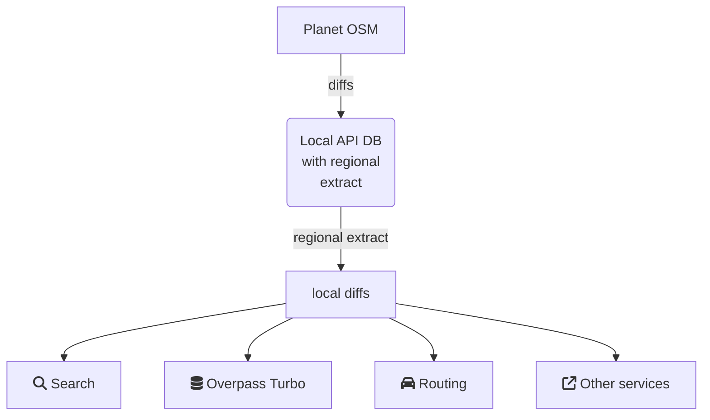

# yamap

Yamap Ain't Map – deployment OSM infrastructure project, inspired by osm-seed.

The goals of the project are to create infrastructure to replicate data from OSM into regional extract and keep the extracted data up-to-date, and use data from the local extract for other local services.

The input data is stored in the DB, the same as the main OSM API DB.

From there, updates are sent to other local services, which in turn reduce the load on OSM servers.
## Schema



## Data deployment and update

For now, next routines are implemented:

- Database deployment
- Populating the database with data from the extract
- Receiving, aggregating, cutting the data by a bounding polygon from planet diffs

### Usage

To initialize DB and populate it with the extract run

```
make init-db
```

To keep up with the upstream DB

```
make run
```

Use `make <target>` to run a particular task.

```
Usage:
  make <target>

Run/Stop Services
  run             Builds, (re)creates, starts containers for a service
  start           Starts existing containers for a service
  stop            Stops running containers without removing them
  restart         Restarts all stopped and running services

Cleanup
  destroy         Stop and remove containers, networks
  clean-apidb     Cleaning of the mounted DB file system
  clean-data      Cleaning the data folder except for the mounted DB file system
  clean-db        TODO Cleaning up DB for fresh deployment

Building
  rebuild         Build or rebuild services if you change a service’s Dockerfile
  init-db         Init fresh DB and populate extract
  debug           Start services in debug mode to run commands manually

Helpers
  list            List containers
  images          List images used by the created containers
  config          Parse, resolve and render compose file in canonical format

Help
  help            Display this help
```

### Preparation

Specify path to the input data extract and path to `*.poly` file 
in the [popdb.env](env/popdb.env).

Replication interval and replication URI can be adjusted in the [repapidb.env](env/repapidb.env).

